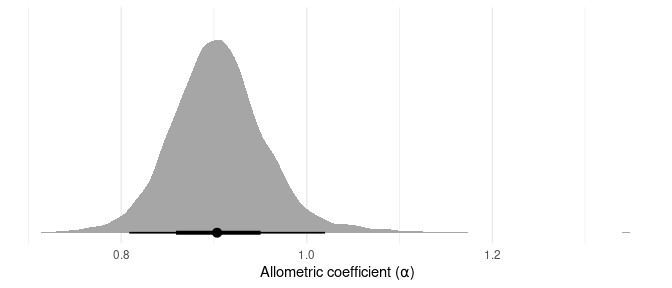
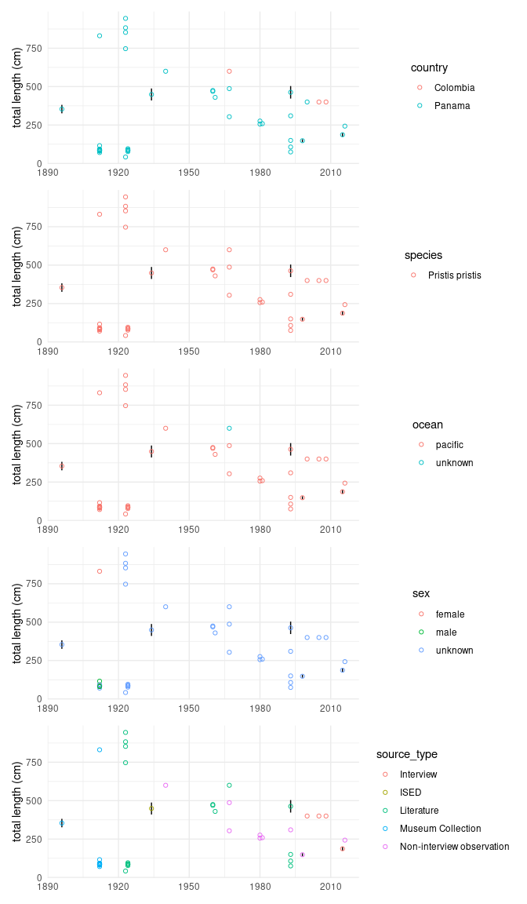

Sawfish
================

## Supplementing length data

By using the rostrum length to infer the total length we could increase
the sample size by 6. It’s not a dramatic increase, but given the
paucity of data it seems to be a valuable exercise. Details of those
observations are shown below.

``` r
drake::loadd(encounters)
encounters %>%
  count(is.na(rostrum_length_cm), is.na(total_length_cm), is.na(reported_collection_year))
```

    ## # A tibble: 8 x 4
    ##   `is.na(rostrum_length_… `is.na(total_length_… `is.na(reported_collectio…     n
    ##   <lgl>                   <lgl>                 <lgl>                      <int>
    ## 1 FALSE                   FALSE                 FALSE                          7
    ## 2 FALSE                   FALSE                 TRUE                           3
    ## 3 FALSE                   TRUE                  FALSE                          6
    ## 4 FALSE                   TRUE                  TRUE                          12
    ## 5 TRUE                    FALSE                 FALSE                         43
    ## 6 TRUE                    FALSE                 TRUE                           3
    ## 7 TRUE                    TRUE                  FALSE                        157
    ## 8 TRUE                    TRUE                  TRUE                          21

``` r
encounters %>%
  filter(is.na(total_length_cm), !is.na(rostrum_length_cm), !is.na(reported_collection_year)) %>%
  select(country, species, ocean, sex, source_type)
```

    ## # A tibble: 6 x 5
    ##   country  species         ocean   sex     source_type              
    ##   <chr>    <chr>           <chr>   <chr>   <chr>                    
    ## 1 Panama   Pristis pristis pacific unknown Museum Collection        
    ## 2 Panama   Pristis sp.     pacific unknown ISED                     
    ## 3 Colombia Pristis sp.     unknown unknown ISED                     
    ## 4 Panama   Pristis pristis pacific unknown Literature               
    ## 5 Panama   Pristis pristis pacific unknown Non-interview observation
    ## 6 Panama   Pristis pristis pacific unknown Interview

## Allometric relationship

We use another model to the allometric relationship between rostrum and
total length. This allows us to estimate the total length for those
encounters that only have rostrum length. As expected the uncertainty is
larger when the species is not known. Note that this would be greatly
improved if we could source existing data from the literature.

<!-- -->

A closer inspection to the allometric coefficient reveals that the
rostrum most likely grows isometrically with total length.

``` r
coefficients <- spread_draws(allometric_model, b_Intercept, b_rostrum_length_cm) %>%
  mutate(alpha = 1 / b_rostrum_length_cm, 
         log_b = b_Intercept / b_rostrum_length_cm * (-1)) %>%
  select(-b_Intercept, -b_rostrum_length_cm) 


coefficients %>%
  ggplot(aes(x = alpha)) +
  stat_halfeye() +
  theme_minimal() + 
  theme(axis.title.y = element_blank(), 
        axis.text.y = element_blank(), 
        panel.grid.major.y = element_blank(), 
        panel.grid.minor.y = element_blank()) + 
  labs(x = "Allometric coefficient (⍺)")
```

<!-- -->

## Length data

Let’s explore the data using different strata. This will allow us to
better identify how data is distributed across different categories and
which ones have the potential to introduce biases in the data.

Most available length-year data is from *Pristis pristis* in the
Panama’s Pacific. There is also a strong bias of the year of different
source types. It would be important to take these biases into account.

In addition a group of records from museums that have small individuals
(\< 1.5 meters) that might not be easily explained by the current
strata. Similar cases for literature sourced encounters where a range of
sizes is available for a given year.

``` r
drake::loadd(length_model_data)

bp <-  length_model_data %>%
  filter(!is.na(reported_collection_year), !is.na(total_length_cm)) %>%
  ggplot(aes(x = reported_collection_year, y = total_length_cm)) +
  geom_linerange(aes(ymin = total_length_cm - total_length_cm_se, 
                     ymax = total_length_cm + total_length_cm_se)) +
  theme_minimal() +
  theme(axis.title.x = element_blank()) +
  labs(y = "total length (cm)")

p1 <- bp + geom_point(aes(colour = country), shape = 21) 
p2 <- bp + geom_point(aes(colour = species), shape = 21)
p3 <- bp + geom_point(aes(colour = ocean), shape = 21)
p4 <- bp + geom_point(aes(colour = sex), shape = 21)
p5 <- bp + geom_point(aes(colour = source_type), shape = 21)

p1 + p2 + p3 + p4 + p5 + plot_layout(ncol = 1)
```

<!-- -->

## Model results

``` r
drake::readd(fig_max_length_vs_time) +
  plot_annotation(title = "Modelling max total length")
```

<!-- -->

``` r
drake::readd(fig_length_vs_time) +
  plot_annotation(title = "Modelling all total length")
```

<!-- -->

## Encounters

``` r
drake::loadd(encounters)

enc_data <- encounters %>%
  filter(reported_collection_year > 1800) %>%
  mutate(source_type = fct_reorder(source_type, reported_collection_year, median), 
         country = fct_infreq(country))

enc_data %>%
  ggplot(aes(x = reported_collection_year, fill = source_type)) + 
  geom_histogram(binwidth = 10, center = 2000) +
  facet_wrap("country", ncol = 2) +
  # scale_fill_brewer(palette = "Set1") + 
  # scale_y_continuous(sec.axis = sec_axis(~ . / nrow(enc_data), 
                                         # labels = scales::label_percent(), name = "Percentage of encounters")) +
  scale_fill_viridis_d() +
  # scale_x_binned(stat  = "co") +
  theme_minimal() +
  theme(legend.position = "top", 
        legend.title = element_blank()) +
  labs(x = "Reported collection year", 
       y = "Number of encounters")
```

<!-- -->

``` r
library(rnaturalearth)
library(rnaturalearthhires)
world <- ne_countries(country = c("Colombia", "Panama", "Costa Rica"), scale = "large", returnclass = "sf")

map_data <-
  encounters %>%
    filter(reported_collection_year > 1800) %>%
  mutate(source_type = fct_reorder(source_type, reported_collection_year, median), 
         across(c(longitude, latitude), as.numeric)) %>%
  filter(latitude > 0)
```

    ## Warning: Problem with `mutate()` input `..2`.
    ## ℹ NAs introduced by coercion
    ## ℹ Input `..2` is `across(c(longitude, latitude), as.numeric)`.

    ## Warning in fn(col, ...): NAs introduced by coercion

    ## Warning: Problem with `mutate()` input `..2`.
    ## ℹ NAs introduced by coercion
    ## ℹ Input `..2` is `across(c(longitude, latitude), as.numeric)`.

    ## Warning in fn(col, ...): NAs introduced by coercion

``` r
p1 <- ggplot(data = map_data) + 
  geom_sf(data = world, inherit.aes = F, alpha = 0.5, colour = "grey30") +
  geom_point(data = map_data, aes(x = longitude, y = latitude, fill = source_type), shape = 21) + 
  scale_fill_viridis_d() +
  theme_minimal() +
  theme(axis.title = element_blank()) +
  coord_sf(xlim = c(-83.9, -73), ylim = c(4.1, 11.9), expand = FALSE) +
  scale_x_continuous(breaks = seq(-90, 90, by = 2)) +
  scale_y_continuous(breaks = seq(-90, 90, by = 2)) +
  labs(fill = "Source")

p2 <- ggplot(data = map_data) + 
  geom_sf(data = world, inherit.aes = F, alpha = 0.5, colour = "grey30") +
  geom_point(data = map_data, aes(x = longitude, y = latitude, fill = reported_collection_year), shape = 21) + 
  scale_fill_stepsn(breaks = seq(1000, 3000, by = 25), colours = viridis::viridis(2)) +
  theme_minimal() +
  theme(axis.title = element_blank()) +
  coord_sf(xlim = c(-83.9, -73), ylim = c(4.1, 11.9), expand = FALSE) +
  scale_x_continuous(breaks = seq(-90, 90, by = 2)) +
  scale_y_continuous(breaks = seq(-90, 90, by = 2)) +
  labs(fill = "Year")

p1 + p2 + plot_layout(ncol = 1) 
```

<!-- -->
