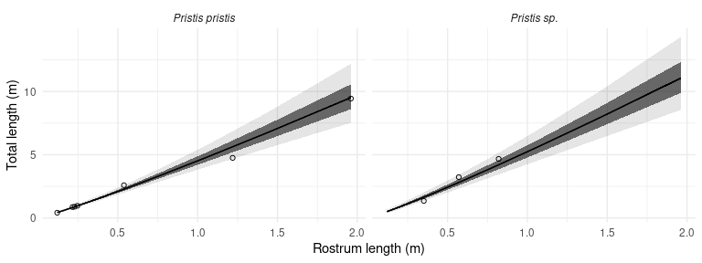
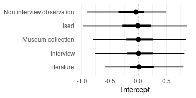

Paper
================

## Methods

A (bayesian) regression model was constructed to investigate how sawfish
size has changed over time. Records in which both total length and date
were available were selected. These records were supplemented with
estimations of total length using the allometric relationship between
rostra and the total length (Supporting Information S1). This analysis
was focused in the *Pristis pristis* size, as this was the species where
most complete records were available. These records were further
filtered to include only the largest total length measurement for a
given year/source type combination. This was done because the limited
number of records in any given year, makes it unlikely that the data
provide a complete picture of the size distribution changes. Many of the
records are likely to correspond to neonate and juvenile individuals and
therefore may offer little information about overall size changes.
Furthermore, by focusing on the largest individuals across time and a
change on the maximum observed size provides information about … \[Juli:
please add here an explanation of why max size is also a biologically
relevant metric\]. Importantly, the results do not qualitatively change
whether we include all records or just those with the largest
individuals (Supporting Information S2).

The response variable in the model was total length and the explanatory
variable was the year of record. The year of record was scaled to have a
zero mean and unit variance prior to inclusion in the model. In
addition, to control for potential biases in the data, random intercepts
for the country of record and the source of the record (museum
collection, literature, ISED, interview and non-interview observation)
were calculated. Total length was modelled using a Binomial distribution
in preference to a Poission distribution because this distribution is
ideal for modelling integer values within a specified range, which is
important in this case because total length has an upper bound. This
upper bound was set at 120% the length of the largest measured specimen.
To account for overdispersion in the data, each observation was included
as an additional random intercept. A weakly informative prior based on a
Student-t distribution with 3 degrees of freedom, a median of zero, and
a scale of two, was used for all model coefficients. The bayesian model
was fitted using `brms 2.14.4` (Bürkner 2017, 2018) which uses a
Hamiltonian Markov Chain Monte Carlo algorithm implemented in `Stan`
(Stan Development Team, 2020). The model was fitted using four chains of
5000 iterations each (including 2500 for warm-up).

## Results

The relationship between rostrum and total length for the largetooth
sawfish *Pristis pristis* was approximately isometric (Supporting
Information S1). Indeed the estimated allometric coefficient between
these two metric was 0.9 (90% credible interval 0.82 to 0.99).

The total length model was based on 20 records. In five of them, total
length was estimated using the allometric relationship between rostrum
and total length. There is a 93.6% probability that the total length of
the largest observed sawfish individuals (*Pristis pristis*) has
decreased between 1896 and 2016 (Figure XXa, Table S2). The median rate
of this decrease is 6% per decade (90% CI -0.6% to 12.3%; Figure XXb).
We found no substantial differences between the intercepts of different
record sources (Figure S2).

<!-- -->

*Figure XX: Maximum length of sawfish Pristis pristis has very likely
declined over time. (a) Dots indicate length of records included in the
model; vertical bars indicate the standard error of total lengths
estimated from rostrum length. Grey bands indicate 66 and 90% credible
intervals. (b) Distribution of the rate of decrease in total length per
decade. The point depict the median value and lines correspond to 66 and
90% credible intervals.*

## Supporting information

### S1: Estimating total length from rostrum length

A (bayesian) regression model was constructed to investigate the
allometric relationship between rostrum and total length. A total of 10
records in which both of these measurements were available were
selected. As is common in allometric estimation, both of these metrics
were log transformed. Then a linear regression was fitted; total length
was the response variable and rostrum length the explanatory variable.
This was done because our primary objective is the estimation of total
length and not the estimation of the allometric coefficient (in which
case a major axis regression would have been more appropriate). In
addition, a random intercept was calculated for each species type. In
the absence of previous information in the literature, we used weakly
informative prior based on a Student-t distribution with 3 degrees of
freedom, a median of zero, and a scale of two, was used for all model
coefficients except the one corresponding to the slope of the
rostrum-total length relationship where a similar Student-t distribution
with a median of one was used. The bayesian model was fitted using brms
2.14.4. Specifically, the model was fitted using four chains of 5000
iterations each (including 2500 for warm-up).

The model accounted for a large proportion of variance in total length
(R2 = 0.98, 90% CI 0.96 to 0.99). Total length scales
isometrically with rostrum length in *Pristis pristis* (Figure S1; Table
S1). Using the model coefficients, the estimated allometric coefficient
between these two metric was 0.9 (90% credible interval 0.82 to 0.99).
The estimated allometric intercept was -0.92 (90% CI -1.39 to -0.51).

### S2: Including all size records

The results are qualitatively similar when all observations in which
total length is available, not just those for the largest individuals
per year, are included in the model. The total length model with all
records was based on 54 records. In five of them, total length was
estimated using the allometric relationship between rostrum and total
length. In this alternative model, total length of encountered sawfish
(*Pristis pristis*) individuals was also very likely to decrease over
the years (52.7% probability). The estimated coefficient for the year
parameter was -0.02 (90% CI -0.49 to 0.41). This coefficient corresponds
to a median rate of decrease of 0% per decade (90% CI -9.5% to 9.7%).

### Supplementary Figures

<!-- -->

*Fig S1: Rostrum and total length in sawfish scales isometrically. The
panels show the relationship between rostrum and total length. Dots
indicate observed data and grey bands indicate 66 and 90% credible
intervals.*

<!-- -->

*Figure S2: There were no substantial differences in the mean total
length across different record sources. Points depict the estimated
median intercept for each of the sources. Lines correspond to 66 and 90%
credible intervals of the intercept.*

### Supplementary Tables

*Table S1: Model coefficients for the allometry model. Intervals
correspond to 95% credible intervals*.

| effect    | group    | term                | estimate | conf.low | conf.high |
|:----------|:---------|:--------------------|---------:|---------:|----------:|
| fixed     | \-       | (Intercept)         |     0.45 |    -3.80 |      2.16 |
| fixed     | \-       | rostrum\_length\_cm |     1.11 |     0.98 |      1.24 |
| ran\_pars | species  | sd\_\_(Intercept)   |     1.25 |     0.03 |      5.74 |
| ran\_pars | Residual | sd\_\_Observation   |     0.16 |     0.09 |      0.29 |

*Table S2: Model coefficients for the total length model. Intervals
correspond to 95% credible intervals*.

| effect    | group        | term              | estimate | conf.low | conf.high |
|:----------|:-------------|:------------------|---------:|---------:|----------:|
| fixed     | \-           | (Intercept)       |    -0.33 |    -1.03 |      0.35 |
| fixed     | \-           | scaled\_year      |    -0.35 |    -0.81 |      0.12 |
| ran\_pars | observation  | sd\_\_(Intercept) |     0.93 |     0.66 |      1.36 |
| ran\_pars | source\_type | sd\_\_(Intercept) |     0.38 |     0.01 |      1.39 |

## References

Paul-Christian Bürkner (2017). brms: An R Package for Bayesian
Multilevel Models Using Stan. Journal of Statistical Software, 80(1),
1-28. <doi:10.18637/jss.v080.i01>

Paul-Christian Bürkner (2018). Advanced Bayesian Multilevel Modeling
with the R Package brms. The R Journal, 10(1), 395-411.
<doi:10.32614/RJ-2018-017>

Stan Development Team. 2020. Stan Modeling Language Users Guide and
Reference Manual, 2.21.0 <https://mc-stan.org>
